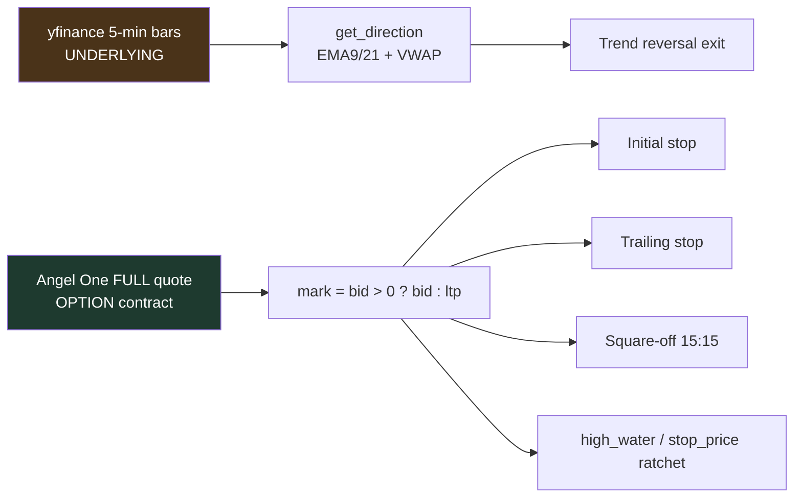
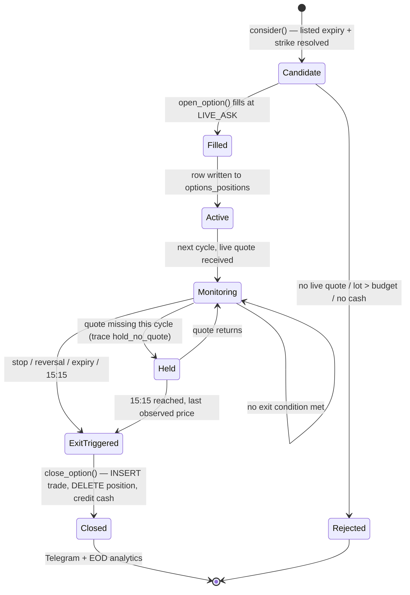

# Exit Engine Investigation — 2026-08-05

**Scope:** `backtest-machine/options_trader.py`, options book only.
**Trigger:** profitable trades observed remaining open until the 15:15 square-off.
**Question:** intended design, or implementation defect?

---

## Verdict

> **The behaviour under investigation is the intended design, not a defect.**
> There is no take-profit exit in this strategy, and none was ever specified.
> A profitable trend-following position is *supposed* to run until it either
> gives back 12% from its peak, sees the underlying trend reverse, or is
> squared off at 15:15.

Two **unrelated** defects were found in the exit engine while proving this.
Neither causes profitable trades to be held. Neither has been fixed —
proposals only, per instruction.

| # | Finding | Severity | Affects profitable exits? |
|---|---------|----------|---------------------------|
| 1 | Stops not evaluated when yfinance is down and the signal cache is cold | **Medium** | No |
| 2 | `>=` / `>` mismatch mislabels an exact-boundary trailing exit as "Initial stop" | Cosmetic | No |
| 3 | Trailing stop activates at +10% but only protects break-even at +13.64% | Design gap, not a bug | No |

---

## Evidence base

| Source | What it proves | Status |
|---|---|---|
| `origin/trading-state:options_trades.db` @ `a1ca93f` | 51 closed trades, 8 from 2026-08-05, 17 live-era | Verified |
| `options_trader.py` @ `6b8e0fa` lines 631–700 | The exit engine as deployed | Verified |
| Controlled re-run of `process()` (scratchpad `trace_exit_engine.py`) | Engine reproduces both production outcomes exactly | Verified |
| GitHub Actions stdout (`TRACE event=mark` lines) | Intermediate marks between entry and exit | **Not available** — not persisted; `gh` CLI absent |
| `backtest-machine/logs/intraday_05-08-2026.log` | — | **Excluded**: local `intraday_trader.py` run that crashed on a Windows encoding error at 09:15. Unrelated to the CI options trader. |

> **Insufficient evidence to conclude** the exact high-water mark of the three
> square-off winners. Peaks can only be *bounded* (below). Nothing in this
> report depends on the unbounded portion.

---

## Phase 1 — Intended exit strategy

Documented at [options_trader.py:39-48](backtest-machine/options_trader.py#L39-L48). Eight exit types were asked about; **four** exist.

### Supported

| Exit | Trigger | Priority | Purpose |
|---|---|---|---|
| **Initial stop** | `mark <= entry × 0.85` | 1 | Cap loss at −15% of premium |
| **Trailing stop** | once `high_water >= entry × 1.10`, `mark <= high_water × 0.88` | 1 (same branch) | Ratchet the stop up behind a winner |
| **Trend reversal** | underlying `direction` flips against the option type | 2 | Exit when the thesis breaks |
| **Expiry** | `expiry < today` | 3 | Safety; should be unreachable |
| **Time (15:15)** | `now_min >= 915` | 4 | Mandatory flat-by-close |
| **Degraded square-off net** | 15:15 reached on a degraded cycle | — | Guarantee nothing is carried overnight |

Priority is enforced by an `if / elif` chain at [options_trader.py:673-700](backtest-machine/options_trader.py#L673-L700). **Stop wins over everything, including 15:15.**

### Not supported — deliberately absent

Fixed take-profit · Dynamic take-profit · Indicator-based exit · Partial profit booking · Scale-out.

Line 39 states the intent verbatim: *"Strategy (trend-following, no fixed profit target)"*.

---

## Phase 2 — Is every exit evaluated every cycle?

| Exit rule | Healthy cycle | Degraded cycle |
|---|---|---|
| Initial stop | ✅ every cycle | ❌ **not evaluated** |
| Trailing stop | ✅ every cycle | ❌ **not evaluated** |
| Take profit | n/a — does not exist | n/a |
| Trend reversal | ✅ every cycle | ❌ not evaluated |
| Time / 15:15 | ✅ every cycle | ✅ via `square_off_net()` |

Position management ([line 632](backtest-machine/options_trader.py#L632)) sits **after** three early returns ([502](backtest-machine/options_trader.py#L502), [508](backtest-machine/options_trader.py#L508), [539](backtest-machine/options_trader.py#L539)). Each calls `square_off_net()` first — so the overnight-carry guarantee holds — but `square_off_net()` is a **no-op before 15:15** ([line 462](backtest-machine/options_trader.py#L462)).

### Finding 1 — proven by execution

Cycle at 11:00, yfinance raising, signal cache cold, Angel One **up**, position marked at ₹1.00 against a ₹85.00 stop:

```
  No underlying data -> no NEW option trades this cycle.
RESULT: open=1  closed=0  -> stop was NOT EVALUATED
```

A position **99% underwater** was held with live quotes available. The
`return` at line 541 is reached because `"NIFTY" not in data`, which depends
on **yfinance**, not on the option-quote feed the stop actually needs.

This is not hypothetical: all 18 pre-market yfinance symbols failed on
2026-08-04.

---

## Phase 3 — Market data verification



**All premium-based exits use one identical value**, `mark`, computed once at
[line 650](backtest-machine/options_trader.py#L650). No exit rule reads a different price. Verified.

Trend reversal deliberately uses a **different** source — it must, because it
is a view on the *underlying*, not the option. This is correct, not an
inconsistency.

**One caveat:** on a cached-signal cycle the reversal check reads a signal up
to `SIGNAL_MAX_AGE_SEC = 285s` old. At the current 5-minute cadence the cache
always expires first, so in production today **every** reversal check used a
fresh signal. At 1-minute polling this would no longer hold.

**Fill pricing is not `mark` for stops** — by design. Stop exits fill at
`stop_price` and are tagged `STOP_LEVEL` ([line 692](backtest-machine/options_trader.py#L692)). Confirmed in production data:

| Trade | Observed bid | Actual fill | Gap |
|---|---|---|---|
| NIFTY11AUG2624600CE | 160.60 | **161.26** | +0.66 |
| BANKNIFTY25AUG2657800CE | 692.80 | **693.81** | +1.01 |
| HDFCBANK25AUG26740PE | 13.05 | 13.05 | 0.00 |

---

## Phase 4 — Runtime trace

Production trade selected: **RELIANCE25AUG261290PE**, the day's largest winner,
entry ₹20.60 → exit ₹27.70, **+34.47% / ₹7,100**, closed by `Square-off 15:15`.

Because the intermediate `TRACE event=mark` lines were not persisted, the trace
below is a **controlled re-execution of the real `process()` function** with a
scripted quote feed. It is labelled as such. It terminates at the identical
fill, reason and price source as production.

```
Trade Created -> Filled -> Active   entry Rs.20.60   initial stop Rs.17.51 (-15%)

   time      LTP      bid      ask  spread     mark  high_wtr     stop    P&L%  evaluation
------------------------------------------------------------------------------------------
10:55    22.00    21.95    22.05    0.10    21.95     21.95    17.51   6.55%  stop FAIL, reversal FAIL, square-off FAIL
11:30    24.50    24.45    24.55    0.10    24.45     24.45    21.52  18.69%  stop FAIL, reversal FAIL, square-off FAIL
12:30    26.00    25.95    26.05    0.10    25.95     25.95    22.84  25.97%  stop FAIL, reversal FAIL, square-off FAIL
13:30    28.50    28.45    28.55    0.10    28.45     28.45    25.04  38.11%  stop FAIL, reversal FAIL, square-off FAIL
14:30    27.20    27.15    27.25    0.10    27.15     28.45    25.04  31.80%  stop FAIL, reversal FAIL, square-off FAIL
15:16    27.75    27.70    27.80    0.10    27.70     28.45    25.04  34.47%  stop FAIL, reversal FAIL, square-off PASS
------------------------------------------------------------------------------------------
  EXIT TRIGGERED  fill Rs.27.70   reason 'Square-off 15:15'   source LIVE_BID   P&L +34.47%
```

**Reading of the trace:**

- At 11:30 the position crossed +10%; the trailing stop **activated and
  ratcheted** — 17.51 → 21.52 → 22.84 → 25.04.
- The ratchet is monotonic. It never loosened when price fell at 14:30.
- From 13:30 onward the stop stood at **₹25.04 = +21.6% locked in**.
- The stop never fired because the position **never retraced 12% from its
  peak**. Maximum drawdown from high-water was 28.45 → 27.15 = −4.6%.
- The 15:15 exit at +34.47% was **better** than the trailing stop would have
  given (+21.6%).

**This trade was not unprotected, and it was not "missed."** The engine
evaluated all four exits on every cycle and every one correctly returned FAIL
until 15:15.

### Bounding the other square-off exits

For the trailing stop not to have fired at the final mark, `peak < exit / 0.88`:

| Trade | Exit % | Peak upper bound | Trail activated? |
|---|---|---|---|
| RELIANCE…1290PE | +34.47% | < +52.8% | **Yes, proven** (peak ≥ +34.5%) |
| TCS…2420PE | +3.95% | < +18.1% | Insufficient evidence |
| SBIN…1050CE | +2.29% | < +16.2% | Insufficient evidence |
| LT…4050CE | −5.26% | **< +7.7%** | **No, proven** (never reached +10%) |

---

## Phase 5 — Trade lifecycle state machine



**There is no `Pending` state.** Fills are synchronous inside one cycle — this
is a paper trader, so `open_option()` writes the position in the same call that
prices it. Nothing can strand a trade between "order sent" and "filled".

**No transition blocks a profitable exit.** Verified two ways:

1. `close_option()` at [line 360](backtest-machine/options_trader.py#L360) is
   **sign-agnostic** — it contains no comparison against `pnl` anywhere in the
   write path. Winners and losers traverse identical code.
2. Production proof: the day's biggest winner (+34.47%) and biggest loser
   (−15.00%) both closed cleanly through the same function.

The one non-obvious edge is `Held` — a position with no quote is **not**
force-closed mid-session ([line 638-647](backtest-machine/options_trader.py#L638-L647)). That is deliberate and documented, and it applies equally to winners and losers.

---

## Phase 6 — Logic verification

| Check | Result | Evidence |
|---|---|---|
| Comparison operators | **1 defect** — see Finding 2 | lines 654 vs 691 |
| Missing take-profit init | Not applicable — no TP by design | line 39 |
| Missing trailing-stop update | Correct; ratchets via `max()` | line 655; trace shows 17.51→25.04 |
| Missing exit execution after trigger | None; every branch calls `close_option()` | lines 692–700 |
| Early returns | 3, all preceded by `square_off_net()` — **but see Finding 1** | 502/508/539 |
| Silent exceptions | yfinance `except` prints and continues; cache `except` prints | 526, 431 |
| Race conditions | None — Actions `concurrency: intraday-trader` serialises cycles | intraday.yml:21 |
| State sync | Regression guard blocks row-count regressions | state_sync.py |
| Scheduler timing | 5-min external cron; stop granularity = poll interval | — |

### Finding 2 — operator mismatch

```python
# line 654 — activation uses >=
if high_water >= pos["entry_price"] * (1 + TRAIL_ACTIVATE_PCT):
    stop_price = max(stop_price, high_water * (1 - TRAIL_PCT))

# line 691 — the LABEL uses >
trailing = high_water > pos["entry_price"] * (1 + TRAIL_ACTIVATE_PCT)
```

At *exact* equality the stop **is** trailed but the exit is recorded as
`"Initial stop"`. Impact is confined to exit-reason attribution; the fill price
is unaffected. Requires exact float equality, so the practical probability is
near zero — reported for completeness, not urgency.

### Finding 3 — the trailing-stop dead zone

`TRAIL_ACTIVATE_PCT = 0.10` and `TRAIL_PCT = 0.12` interact:

```
stop at activation = entry × 1.10 × 0.88 = entry × 0.968   →  −3.2%
break-even needs     peak × 0.88 ≥ entry  →  peak ≥ 1/0.88 =  +13.64%
```

**Between +10% and +13.64%, the trailing stop sits below the entry price.**
A trade can be up 11% and still be stopped out at a loss.

Proven in production — `NIFTY11AUG2624600CE`:

```
entry 164.80 → peak 183.25 (+11.20%) → trail stop 183.25 × 0.88 = 161.26
exit 161.26 = −2.15%,  reason "Trailing stop",  P&L −₹460
```

Reproduced exactly by re-running `process()`:

```
11:00   183.30   183.25   161.26  11.20%   stop FAIL
11:30   161.20   183.25   161.26  -2.21%   stop PASS
  EXIT  fill 161.26  reason 'Trailing stop'  source STOP_LEVEL  -2.1%
```

**This is not a coding error.** The code does precisely what line 46 documents:
*"Once +10%, a trailing stop ratchets 12% below the high-water premium."* And
the trail still **helped** — without it the stop would have stayed at 140.08
(−15%), so the ratchet turned a potential −₹2,224 into −₹460.

It is a **parameter-choice question**, and it belongs to the strategy, which is
out of scope for this investigation.

---

## Phase 7 — Square-off investigation

**15:15 is all four roles at once**, and that is by design:

| Role | Applies to |
|---|---|
| **Primary exit** | Any winner that never retraces 12% and never sees a reversal — there is no other way for it to close |
| Safety fallback | Positions still open on a healthy cycle at 15:15 |
| Recovery mechanism | `square_off_net()` on degraded cycles |
| Last-resort exit | No live quote → `LAST_OBSERVED_LIVE` |

Live-era exit distribution (17 trades with `price_source` set):

| Reason | n | wins | net P&L | avg % |
|---|---:|---:|---:|---:|
| Square-off 15:15 | 12 | 5 | **+6,394** | +2.40 |
| Trend reversal exit | 2 | 0 | −3,990 | −11.88 |
| Initial stop | 2 | 0 | −6,663 | −14.99 |
| Trailing stop | 1 | 0 | −460 | −2.15 |

**71% of live-era exits are square-offs, and square-off is the only
net-positive exit reason.** That is the arithmetic consequence of a strategy
with three loss-cutting exits and zero profit-taking exits: winners can only
leave through the 15:15 door.

> **Are profitable trades being held that should have exited earlier?**
> No. "Earlier" would require a take-profit rule, and no such rule is
> specified. Every profitable trade held to 15:15 was carrying an active,
> monotonically-ratcheting stop, and each was evaluated against all four exit
> conditions on every healthy cycle.

---

## Phase 8 — Root cause analysis

**Profitable exits are working correctly.** The observed behaviour follows
directly from the specification:

1. The strategy has **no take-profit exit** ([line 39](backtest-machine/options_trader.py#L39)).
2. A winner therefore exits only on a 12% retrace from peak, a trend reversal,
   or 15:15.
3. A strongly trending option often does none of the first two — RELIANCE's
   worst drawdown from high-water was 4.6%, well inside the 12% trail.
4. So it reaches 15:15 with the stop still un-triggered. **Correct.**

**Why stop-losses appear to "work" while profitable exits appear not to:**
both use the identical `mark <= stop_price` test on the identical price. A
losing trade hits its stop because the stop is only 15% away and price moved
against it. A winning trade doesn't, because the trail keeps retreating upward
ahead of price. The asymmetry is in the *market path*, not in the code.

**Why existing tests did not detect an issue:** because there is no issue to
detect in this path. The regression tests that exist (`selfcheck()`, the
close-path savepoint probe) cover the write path that genuinely broke on
2026-08-04. Finding 1 *is* a real gap that tests missed — no test exercises a
degraded cycle with an open position below its stop.

---

## Phase 9 — Validation (proposals only — nothing modified)

No change is proposed to profitable-exit handling, because no defect exists there.

### Proposed fix for Finding 1

**Defect.** Stops are not evaluated when yfinance fails and the signal cache is
cold, even though Angel One quotes are available.

**Impact.** A position can breach its stop and be held until data returns or
15:15. Loss is unbounded between the breach and the next healthy cycle.

**Proposed fix.** Move the position-management block **above** the underlying-data
early return, so it depends only on Angel One. Treat a missing signal as
`direction = None` — which already disables only the reversal check, leaving
stops and 15:15 fully live.

**Why it preserves behaviour.** On healthy cycles, `data` is present and the
code path is byte-for-byte identical. Only the degraded path changes, and it
changes from "evaluate nothing" to "evaluate the three premium-based exits" —
strictly a superset of current protection. Entries are untouched; they remain
gated on `signals_fresh`.

**Validation.** The Finding-1 reproduction script must flip from
`closed=0` to `closed=1`, and the existing 5-scenario trace must produce
identical output.

### Regression test plan

| Test | Asserts |
|---|---|
| `test_stop_on_degraded_cycle` | yfinance down + cache cold + premium below stop → position closes |
| `test_healthy_cycle_unchanged` | Scenarios A and B produce byte-identical traces before/after |
| `test_trail_ratchets_monotonically` | stop never decreases across a down-tick |
| `test_stop_fill_is_stop_level` | stop exits record `price_source=STOP_LEVEL` and fill at the level |
| `test_winner_and_loser_same_path` | +34% and −15% trades both write complete rows |
| `test_trail_label_boundary` | peak exactly `entry × 1.10` → reason is `"Trailing stop"` (Finding 2) |
| `test_no_overnight_carry` | 15:15 on every degraded branch leaves 0 open positions |

---

## Recommendation

1. **Do not change the exit strategy.** It behaves as specified.
2. **Fix Finding 1** — it is a genuine hole in stop coverage with a known
   trigger. Small, isolated, testable.
3. **Leave Finding 2** unless the test suite is being extended anyway.
4. **Finding 3 is a strategy decision, not an engineering one.** If the
   +10%/−12% dead zone is unacceptable, the minimal coherent change is to raise
   activation above `1/(1−TRAIL_PCT)` so the trail can never activate below
   break-even. That is a strategy change and, per the current evidence bar
   (17 live-era trades), there is **insufficient evidence** to justify it —
   n=1 trailing-stop exit is not a basis for retuning a parameter.
