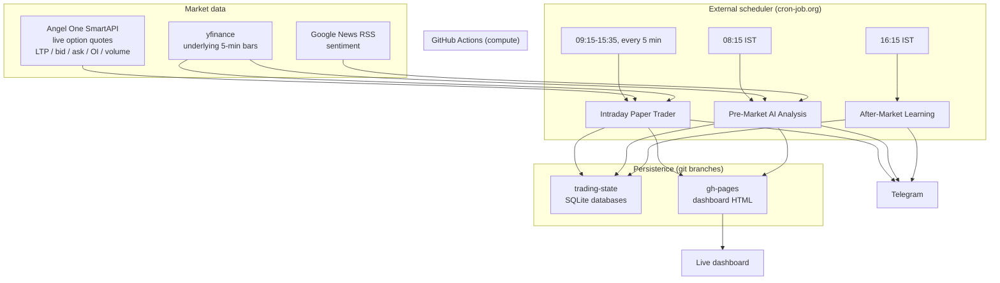

# Intraday Paper Trading System — NSE

An automated **paper trading** system for the Indian stock market. It runs
entirely on GitHub's servers, so it trades every market day whether or not
your computer is on, and reports to Telegram and a live web dashboard.

> **This is paper trading — no real money, no real orders.** It executes a
> simulated book against **real live market prices**. Nothing here places an
> order with a broker.

---

## Table of contents

- [What it does](#what-it-does)
- [Architecture](#architecture)
- [Daily schedule](#daily-schedule)
- [The three books](#the-three-books)
- [Execution pricing contract](#execution-pricing-contract)
- [Ranking engine (shadow mode)](#ranking-engine-shadow-mode)
- [Data sources and provenance](#data-sources-and-provenance)
- [Module reference](#module-reference)
- [Configuration](#configuration)
- [Setup](#setup)
- [Monitoring and verification](#monitoring-and-verification)
- [Honest findings and limitations](#honest-findings-and-limitations)
- [Development](#development)

---

## What it does

Every trading day the system:

1. **Analyses the market before the open** — global indices, VIX, crude,
   gold, DXY, Asian and European markets, Indian technicals, news
   sentiment, and a similarity search against its own history — then issues
   a **BUY CALL / BUY PUT / NO TRADE** call with a confidence score.
2. **Trades two simulated books** during market hours — a stock book and an
   NSE options book — using live prices.
3. **Manages risk continuously** — stop-losses, trailing stops, trend-reversal
   exits, and a hard square-off at 15:15. Nothing is held overnight.
4. **Grades itself after the close** — was the morning call right, what did
   each trade cost, and why did winners win.
5. **Reports everything** — Telegram alerts in real time, plus a dashboard
   that refreshes through the day.

---

## Architecture



**Why an external scheduler?** GitHub's built-in `schedule:` trigger is
documented as best-effort. In practice it fired the trading workflow only
1–2 times per day instead of every few minutes, and delayed the pre-market
report by up to 8 hours. Both workflows are now triggered externally via
`workflow_dispatch` and the internal cron triggers were removed.

**Why git branches for state?** GitHub Actions runners are ephemeral — each
run starts with a clean filesystem. Trading state (cash, positions, trade
history) is restored from the `trading-state` branch at the start of every
run and pushed back at the end.

---

## Daily schedule

| Time (IST) | What runs | Output |
|---|---|---|
| **08:15** | Pre-market AI analysis | Telegram report with the day's call |
| **09:15** | Market-open notification | Telegram |
| **09:15–15:35** | Trading cycle (every 5 min) | Trade alerts + dashboard refresh |
| **15:15** | Square-off — everything closed | Telegram |
| **16:15** | Learning + analytics | EOD summary, attribution, strategy stats |

---

## The three books

### 1. Stock book — `simple_trader.py`

Buys four liquid NSE stocks at the open, holds intraday, exits on a profit
target, a −1% stop, or the 15:15 square-off. Prices come from yfinance.

### 2. Options book — `options_trader.py`

The main strategy. Trend-following on NSE options with **no fixed profit
target** — winners are allowed to run.

- **Universe**: NIFTY, BANKNIFTY + 18 F&O stocks
- **Signal**: EMA9/21 + VWAP confluence on the *underlying*; a momentum
  fallback tops up the day's quota from 11:00
- **Instrument**: nearest-to-spot (ATM) strike, nearest real listed expiry
- **Sizing**: whole lots only, ₹25,000 budget per position, max 4 concurrent
- **Exits** (whichever fires first):

| Exit | Trigger |
|---|---|
| Initial stop | premium −15% from entry |
| Trailing stop | −12% from the high-water premium, active once +10% up |
| Trend reversal | underlying EMA/VWAP flips against the position |
| Square-off | 15:15, unconditional |

### 3. Pre-market AI — `premarket_analyzer.py`

Six signals (global cues, Asia, volatility, news sentiment, Nifty trend,
historical similarity) vote on direction. A trade is called only when
**≥4 of 6 agree and confidence ≥75%** — otherwise **NO TRADE**. Optionally
adds a second opinion from Claude if `ANTHROPIC_API_KEY` is set.

---

## Execution pricing contract

This is the most important invariant in the codebase.

**Every price that affects money derives from live market data.** There is
no synthetic or model pricing anywhere in the execution path. Every trade
records where its fill came from:

| `price_source` | Meaning |
|---|---|
| `LIVE_ASK` | Entry — filled at the live ask (crossing the spread) |
| `LIVE_BID` | Exit — filled at the live bid |
| `LIVE_LTP` | Fallback when there is no depth on the book |
| `STOP_LEVEL` | Stop-triggered exit — filled **at the stop level** |
| `LAST_OBSERVED_LIVE` | Square-off with no live quote — last real price seen |

**Why `STOP_LEVEL` exists.** The bot only evaluates exits when its scheduler
fires. A stop breached between runs used to be booked at whatever price the
bot found on waking — charging the strategy twice, once for the market move
and again for polling latency. A real broker stop triggers the instant price
touches the level. Stop exits now fill at the stop level, applied
identically to winners (trailing stops) and losers, and the observed market
price is logged alongside for audit.

**If there is no live quote, the bot refuses to open the position.** An open
position with no quote is held, never marked to a model.

**Black-Scholes is retained for analytics only** — fair value and the
mispricing edge recorded on each trade. It never sets a fill, stop, size,
or P&L figure.

---

## Ranking engine (shadow mode)

`ranking_engine.py` scores every candidate on weighted, measurable features
and produces an explainable ranking. It runs in one of three modes:

| Mode | Behaviour |
|---|---|
| `off` | Not consulted at all |
| **`shadow`** (default) | Scores and logs everything, stamps score/rank on every trade — **the baseline still makes every decision** |
| `active` | Ranked selection decides entries, with liquidity gates, sector caps and a dynamic trade count |

Default weights, derived from a 785-sample study (see
[Honest findings](#honest-findings-and-limitations)):

| Feature | Weight | Rationale |
|---|---|---|
| `rel_strength` | 0.30 | Best-supported separator in the study |
| `option_liquidity` | 0.25 | Spread cost is arithmetic, not prediction |
| `trend_quality` | 0.10 | Favours *fresh* trends (measured) |
| `momentum` | 0.10 | Untested — shadow-validating |
| `signal_tier` | 0.10 | Confluence beats momentum fallback |
| `history` | 0.10 | Gated: needs ≥10 live-era trades per symbol |
| `risk_reward` | 0.05 | Neutral proxy for now |
| `market_alignment` | **0.00** | Contradicted in the test window — logged, not traded on |

In `active` mode the number of trades scales with confidence: score ≥0.75 →
3 trades, ≥0.62 → 2, ≥0.52 → 1, below that → none.

**Shadow mode is proven inert** — an integration test asserts that with
identical inputs, `off` and `shadow` produce identical positions.

---

## Data sources and provenance

| Value | Source |
|---|---|
| Option LTP, bid, ask, volume, open interest | 🟢 Angel One SmartAPI (live) |
| Instrument tokens, lot sizes, listed strikes, real expiries | 🟢 Angel One instrument master |
| Implied volatility | 🟢 Angel One `optionGreek` |
| Underlying 5-min bars (signals only) | 🟡 yfinance |
| Global markets, VIX, crude, gold, DXY | 🟡 yfinance |
| News sentiment | 🟡 Google News RSS + keyword scoring |
| Fair value, mispricing edge | 🔵 Computed (analytics only) |

**Not available on any free source:** NSE option-chain PCR and Max Pain
(NSE blocks cloud IPs), and GIFT Nifty (the gap estimate is a proxy built
from US close + Asia + sentiment).

---

## Module reference

| File | Purpose |
|---|---|
| `options_trader.py` | Options book — signals, live-price execution, risk management |
| `simple_trader.py` | Stock book — buy at open, exit on target/stop/close |
| `angelone_client.py` | Angel One auth (TOTP), instrument master, live quotes |
| `ranking_engine.py` | Candidate scoring, liquidity gates, sector caps, tiers |
| `trade_analytics.py` | Attribution, learning stats, baseline-vs-ranked comparison |
| `research_signal_quality.py` | Offline study: which features predict follow-through |
| `premarket_analyzer.py` | Pre-market multi-factor analysis and the daily call |
| `eod_learner.py` | Grades the morning call, writes the EOD summary |
| `market_memory.py` | Historical day store + similarity search |
| `generate_dashboard.py` | Renders the self-contained HTML dashboard |
| `verify_live_data.py` | On-demand probe proving live data is real |
| `backtest.py`, `intraday_backtest.py` | Offline strategy backtesters |

---

## Configuration

All in `backtest-machine/intraday_config.json`:

```jsonc
{
  "mode": "paper",
  "symbols": ["RELIANCE.NS", "HDFCBANK.NS", ...],   // 18 F&O stocks
  "capital": 100000,
  "max_capital_per_trade": 25000,
  "max_open_positions": 4,
  "entry_start": "09:30",
  "entry_end": "14:30",
  "square_off": "15:15",
  "ranking": {
    "mode": "shadow",          // off | shadow | active
    "weights": { ... },
    "tiers": [ ... ],          // dynamic trade count by confidence
    "max_per_sector": 2,
    "liquidity": { "max_spread_pct": 5.0, "min_oi": 500, "min_volume": 100 }
  }
}
```

Secrets live in **GitHub repository secrets**, never in the repo:

| Secret | Required | Purpose |
|---|---|---|
| `TG_BOT_TOKEN`, `TG_CHAT_ID` | For alerts | Telegram reporting |
| `ANGEL_API_KEY`, `ANGEL_CLIENT_CODE`, `ANGEL_PIN`, `ANGEL_TOTP_SECRET` | For options | Live option market data |
| `ANTHROPIC_API_KEY` | Optional | Claude second opinion in the pre-market report |

---

## Setup

<details>
<summary><b>1. Telegram bot</b></summary>

1. Message `@BotFather` → `/newbot` → copy the token
2. Send your bot a message, then open
   `https://api.telegram.org/bot<TOKEN>/getUpdates` and copy `chat.id`
3. Add both as repository secrets
</details>

<details>
<summary><b>2. Angel One SmartAPI (for live option data)</b></summary>

1. Open a free Angel One account
2. Register at [smartapi.angelone.in](https://smartapi.angelone.in) → create
   an app → copy the **API Key**
3. Enable TOTP 2FA and save the **text secret** (not just the QR)
4. Add all four values as repository secrets

TOTP means the bot logs in fresh on every run — no daily token refresh.
</details>

<details>
<summary><b>3. External scheduler</b></summary>

Create three jobs at [cron-job.org](https://cron-job.org), all `POST` with
timezone **Asia/Kolkata** and headers
`Authorization: Bearer <github-token>`, `Accept: application/vnd.github+json`,
`Content-Type: application/json`:

| Job | URL suffix | Body | Schedule |
|---|---|---|---|
| Trader | `workflows/intraday.yml/dispatches` | `{"ref":"main"}` | every 5 min, 09:15–15:35 |
| Pre-market | `workflows/premarket.yml/dispatches` | `{"ref":"main","inputs":{"job":"premarket"}}` | 08:15 |
| Learning | `workflows/premarket.yml/dispatches` | `{"ref":"main","inputs":{"job":"eod"}}` | 16:15 |

Base URL: `https://api.github.com/repos/<owner>/<repo>/actions/`

The GitHub token needs **Actions: read and write** on this repository only.
A successful trigger returns **204 No Content**.
</details>

<details>
<summary><b>4. Dashboard</b></summary>

Repo must be **public** (Pages needs a paid plan otherwise, and public repos
get unlimited Actions minutes). Then **Settings → Pages → Deploy from a
branch → `gh-pages` / root**.
</details>

---

## Monitoring and verification

**Dashboard** — stat tiles, daily and cumulative P&L charts, open positions,
recent trades, and the AI call history with verdicts. Refreshes on every
trading cycle.

**Verify live data on demand** — Actions → **Verify Live Market Data** → pick
a symbol/strike/type. It checks login, contract resolution, and the live
quote independently, prints LTP/bid/ask/volume/OI, and sends the same to
Telegram so you can compare against your broker app. Exits non-zero on
failure so a problem shows red rather than hiding in a green run.

**Trade traces** — every option decision prints a structured line:

```
TRACE event=ENTRY symbol=RELIANCE25AUG261300CE token=141832
      ltp=27.05 bid=26.90 ask=27.20 fill=27.20 volume=48250 oi=31900
      lots=1 lotsize=500 qty=500 cost=13600 stop=23.12
      rank_score=0.7652 rank=1 tier=confluence price_source=LIVE_ASK
```

---

## Honest findings and limitations

These are measured results, recorded so the system isn't oversold.

### The base signal has no measurable intraday edge

A 57-day study (`research_signal_quality.py`) over **785 signal-days**,
measuring forward return 09:30→15:15 signed by signal direction, using only
data available at 09:30:

| Bucket | n | Hit rate | Mean return |
|---|---|---|---|
| **All confluence signals** | 785 | **47.3%** | −0.068% |
| Relative strength confirms | 562 | 48.8% | −0.042% |
| Relative strength contradicts | 223 | 43.5% | −0.134% |
| Trend fresh | 411 | 49.1% | −0.010% |
| Trend established | 374 | 45.2% | −0.133% |
| Aligned with NIFTY | 492 | 44.1% | −0.150% |
| Opposed to NIFTY | 152 | 48.0% | +0.059% |

**47.3% before costs.** Ranking and better execution reduce cost and reduce
the number of low-quality trades — they cannot create edge that isn't there.
Treat this as a well-instrumented research platform, not a profitable system.

### Other limitations

- **Polling gap.** The bot only acts when its scheduler fires. Between runs
  nothing is watched. The `STOP_LEVEL` fill removes the accounting penalty
  but assumes an ideal fill — a genuine price gap would fill worse.
- **Not tick-by-tick.** True continuous stops need a persistent WebSocket
  daemon, which is a different architecture from cron-fired batch runs.
- **Capacity.** With real lot sizes (RELIANCE 500, WIPRO 3000, TCS 225),
  ₹100,000 supports roughly 4 concurrent positions and 4–7 trades a day.
- **Statistics need samples.** `trade_analytics.py` reports sample sizes and
  refuses to recommend switching to `active` mode below 100 scored closed
  trades.
- **NSE data gaps.** PCR, Max Pain and GIFT Nifty are unavailable from free
  sources on cloud IPs.

---

## Development

```bash
cd backtest-machine
pip install -r requirements.txt

python options_trader.py            # one trading cycle
python premarket_analyzer.py        # pre-market report
python trade_analytics.py           # attribution + strategy stats
python research_signal_quality.py   # re-run the signal study
python ranking_engine.py            # ranking engine self-test
python verify_live_data.py TCS 1840 CE
```

Without Angel One credentials the options book will refuse to trade and say
so — that is the intended fail-safe, not an error.

### Design principles

1. **No synthetic prices in execution.** If live data is missing, refuse to
   trade rather than invent a price.
2. **Fail loud, not silent.** A failure that looks like "no data" is worse
   than a crash.
3. **Every fill is auditable.** `price_source` on every trade; a structured
   trace for every decision.
4. **Changes ship behind a flag.** Shadow mode gathers evidence before
   anything alters live behaviour.
5. **Report sample sizes.** A statistic without its `n` is not evidence.

---

## Disclaimer

Educational paper-trading project. Not investment advice. No real orders are
placed. Historical or simulated performance does not predict future results.
Do not deploy real capital on this without independent validation.
